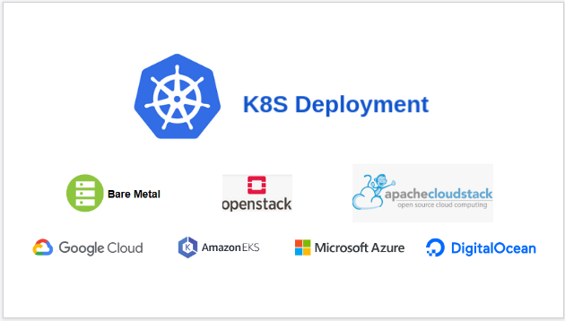

# Kubernetes (k8s) Deployment Operator
######  K8S cross projects deployment operator 


[](https://docs.google.com/presentation/d/1LM6MNMDUgDSNxpqXsV3VJkSRqDTVK7yC5eX1EUZdhsg/edit?usp=sharing)


## Run Deployment Commands:
```shell script
devspace run help       # List all commands
devspace run dev        # Dev mode. Build, Deploy, Expose Application locally and run K8S UI.
devspace run build      # Run build 
devspace run deployment # Run K8S Deployment Stack
devspace run delete     # Delete K8S Deployment
devspace run k8s-image-repo-secret  # Required for DigitalOcean and Azure Kubernetes
devspace run push-image # Push image to docker registry
```
* NOTE: Before run commnads have to configure files into root directory, see Requirements compartment 

## Tools used and required
* Devspace
* Kubernetes Kustomization
* Bash
* kubectl and kubeconfig    # ask DevOps team about k8s config file
* envsubst

###### Install tools
```shell script
sudo bash k8s-deployment/deploy.sh --installTools=true
```
## Deploy initializing (first steps)
* Create/update default files: .env, .gitignore, .dockerignore, devspace.yaml, kustomization.yaml
```shell
git submodule add -b production -f ../../devopss-tools/k8s-deployment.git
bash k8s-deployment/initDeploy.sh
bash k8s-deployment/deploy.sh --cronJobs=true
```
## Lens | The Kubernetes IDE
###### [Download LENS](https://github.com/lensapp/lens/releases/tag/v3.6.9) for Linux, Windows and/or macOS.


## Requirements
````
* devopss-tools VPN connection to k8s Cluster;
* K8S Cluster API Server config data generated by IaaS project (ask DevOps Team);
* add git submodules (p.1.);
* add kustomization.yaml file into project root directory, (there is a full kustomization.yaml template into k8s-deployment/templates/, or examples into k8s-deployment/templates/kustomization.yaml.examples/ );
* add devspace.yaml file into project root directory, (there is a template into k8s-deployment/templates/devspace.yaml);
* add deployment environment variables file .env (p.3) if is running locally or envVars CI/CD file (settings -> CI/CD -> variables);
* add/update .gitignore  file into project root directory, (there is a template into k8s-deployment/templates/.gitignore);
* add/update .dockerignore file into project root directory, (there is a template into k8s-deployment/templates/.dockerignore);
* add/update .gitlab-ci.yml file into project root directory, (there is a template into k8s-deployment/templates/.gitlab-ci.yml);
* If need application configuration file, have to add ./app_config.tpl file into project root directory;
* If need more deployments have to add alternatives patches and configMapGenerator/s ;
````
* NOTE: For custom kustomization yaml file (ex: kustomization_dev.yaml, kustomization_prod.yaml add K8S_KUSTOMIZATION_FILE into .env file)
  Example of media api: kustomization_gdb.yaml and kustomization_tcards.yaml because K8S patches are not the same).

### 1. Add git submodule:
###### For mount this project into another project root directory have to run command into root directory of another project:
* Run locally 
```shell script
git submodule add -b production -f ../../devopss-tools/k8s-deployment.git
```
or
```shell script
git clone -b production ../../devopss-tools/k8s-deployment.git
# NOTE: add k8s-deployment/ to .gitignore and .dockerignore
```

* CI/CD (check branch version)
```yaml
deploy_to_production:
...
  image:
    name: $CI_REGISTRY/devopss-tools/k8s-deployment:ci-cd-tools-v02
...
  before_script:
    - git submodule sync
    - git submodule update --init
    - git submodule add -b production ../../devopss-tools/k8s-deployment.git
...
```

### 2. Add K8S deployment kustomization.yaml
##### 2.2. Bases (bases deployment objects):
```yaml
  - k8s-deployment/deployment/
  - k8s-deployment/service/
  - k8s-deployment/ingress/
  - k8s-deployment/deployment/alternative_deployment_1/
  - k8s-deployment/deployment/alternative_deployment_2/
...
```

##### 2.2. Patches (additional deployment objects that are merged into bases objects):
* Add patches into kustomization.yaml project file, list of all patches you can find into k8s-deployment/templates/kustomization.yaml file
```yaml
# example:
patchesStrategicMerge:
  - k8s-deployment/overlays/security/secret-image-repository.yml    # before run> devspace run k8s-image-repo-secret 
  - k8s-deployment/overlays/deployment/replicas.yml
  - k8s-deployment/overlays/storage/volume-app-config-file.yml      # Required configMapGenerator with name ${PROJECT_NAME}-app-configfile
  - k8s-deployment/overlays/environments/app-env-variables-file.yml   # Required configMapGenerator with name ${PROJECT_NAME}-app-env-variables-file
  - k8s-deployment/overlays/alternative_deployment_1/app-env-variables-file.yml # Required configMapGenerator with name ${PROJECT_NAME}-${K8S_ALTERNATIVE_DEPLOYMENT_1_NAME}-app-env-variables-file 
  - k8s-deployment/overlays/alternative_deployment_2/app-env-variables-file.yml # # Required configMapGenerator with name ${PROJECT_NAME}-${K8S_ALTERNATIVE_DEPLOYMENT_2_NAME}-app-env-variables-file
...
```
##### 2.3. Container environment variables:
* Containers environment variables (.env_vars) is created by deploy.sh. All variables from .env file (except K*S_*, DOCKER_*, AWS_*, AZ_*).
```yaml
configMapGenerator: # declare only once 
- name: ${PROJECT_NAME}-app-env-variables-file
  env: ./.env_vars # Containers environment variables is created by deploy.sh, must to be. All APP_* from .env file.
  literals:
  - SERVICE=main-api
- name: ${PROJECT_NAME}-${K8S_ALTERNATIVE_DEPLOYMENT_1_NAME}-app-env-variables-file
  env: ./.env_vars # Containers environment variables is created by deploy.sh, must to be. All APP_* from .env file.
  literals:
  - SERVICE=notification
- name: ${PROJECT_NAME}-${K8S_ALTERNATIVE_DEPLOYMENT_2_NAME}-app-env-variables-file
  env: ./.env_vars # Containers environment variables is created by deploy.sh, must to be. All APP_* from .env file.
  literals:
  - SERVICE=notification
- name: ${PROJECT_NAME}-nginx-container-configfile
  files:
  - k8s-deployment/configmap/nginx/default.conf # required for any options
  - k8s-deployment/configmap/nginx/media.conf
...
```    

##### 2.4. Application configuration file:
* Have to add ./app_config.tpl file into project root directory, and add the following into kustomization.yaml:
```yaml
configMapGenerator: # declare only once 
- name: ${PROJECT_NAME}-app-configfile
  files:
  - app_config.tpl
...
```
##### 2.4. Bases K8S objects:
```yaml
bases:  
## All bases k8s objects (deployment, service and ingress).
  - k8s-deployment/deployment/
  - k8s-deployment/service/
  - k8s-deployment/ingress/
## Additional deployments for this service (alternative services)
  - k8s-deployment/deployment/alternative_deployment_1/
  - k8s-deployment/deployment/alternative_deployment_2/
## Additional service for nginx container from main POD
  - k8s-deployment/service/nginx
```

### 3. .env file variables
##### 3.1. Base environment variables must to be set 
```.env
PROJECT_NAME=<project-name>
PROJECT_DOMAIN_NAME=<project-name>.github.com
K8S_APP_NAMESPACE=<project-name>
K8S_ENV=production
K8S_URL_PATH=/
K8S_HEALTH_PATH=/health
K8S_CONTAINER_PORT=3000
K8S_DOCKER_REP_USER=<gitlab-group-project-token-name>
K8S_DOCKER_REP_PSWD=<gitlab-group-project-token>
K8S_DOCKER_IMAGE=github.com:4567/<project-group>/<project-name>  # check container registry
DOCKER_REPO_IMAGE=github.com:4567/<project-group>/<project-name>  # check container registry
```
* NOTE: K8S_DOCKER_IMAGE have to be kubernetes deployment image pull registry

##### 3.2. Base environment variables for alternatives deployments
```.env
K8S_ALTERNATIVE_DEPLOYMENT_1_NAME=celery
K8S_ALTERNATIVE_DEPLOYMENT_1_REPLICAS=2
K8S_ALTERNATIVE_DEPLOYMENT_1_COMMAND=[ "celery", "-A", "config", "worker", "-l", "info" ]
K8S_ALTERNATIVE_DEPLOYMENT_2_NAME=payment-processor
K8S_ALTERNATIVE_DEPLOYMENT_2_REPLICAS=2
```
##### 3.3. K8S API SERVER environment variables (generated by IaaS project: devopss-tools/iaas/ansible/certificates/`<env>`/k8s_access_roles/`<project>`/`<project>`.kubeconfig)
```.env
K8S_CA=<certificate-authority-data>
K8S_CLIENT_CERT=<client-certificate-data>
K8S_CLIENT_KEY_DATA=<client-key-data>
K8S_CLUSTER_SERVER_URL=<server>             # https://<dns name to api server>:6443
K8S_CLUSTER_USER=<user.name>                # admin-<project-name>
# or
K8S_CA=<certificate-authority-data>
K8S_CLUSTER_SERVER_URL=<server>             # https://<dns name to api server>:6443
K8S_CLUSTER_SERVER_URL=<server>             # https://<dns name to api server>:6443
K8S_USER_ADMIN_TOKEN=<service account token/secret>
```
##### 3.4. Following environment variables have to be configured into .gitlab-ci.yml file
```yaml
variables:  # global variables
  DOCKER_REPOSITORY: "$CI_REGISTRY/$CI_PROJECT_PATH"
  DOCKER_REPO_IMAGE: "$CI_REGISTRY/$CI_PROJECT_PATH"

build_test: # or deploy_to_test:  
  variables:
    VERSION: "${VersMajor}.${VersMinor}.${VersPatch}-${CI_PIPELINE_IID}"
    DOCKER_IMAGE_TAG: "${VersMajor}.${VersMinor}.${VersPatch}-${CI_PIPELINE_IID}"
    K8S_DOCKER_TAG: "${VersMajor}.${VersMinor}.${VersPatch}-${CI_PIPELINE_IID}"

build_production:   # or   deploy_to_production: 
  variables:
    VERSION: "${VersMajor}.${VersMinor}.${VersPatch}"
    DOCKER_IMAGE_TAG: "${VersMajor}.${VersMinor}.${VersPatch}"
    K8S_DOCKER_TAG: "${VersMajor}.${VersMinor}.${VersPatch}"
```
##### 3.5. Additional .env variables   
* For running locally have to add these variables:
```.env
K8S_DOCKER_TAG=1.0.0-207
K8S_DOCKER_REP_USER=ZGFudS5kd1icmF2ZWudQ==      # base64 encrypted docker registry username
K8S_DOCKER_REP_PSWD=V3Vb3MxMDI5A==              # base64 encrypted docker registry password
```
* Other variables with default values: 
```.env
K8S_REPLICAS=1
DOCKER_FILE_PATH=./Dockerfile   # relative path
K8S_DEPLOYMENT_TIMEOUT=120  # for CI/CD depends of number of replica, ask DevOps
K8S_CONTAINER_RAM_LIMIT=250Mi
K8S_CONTAINER_RAM_REQUEST=100Mi
K8S_CONTAINER_CPU_LIMIT=200m
K8S_CONTAINER_CPU_REQUEST=100m
K8S_INGRESS_CLASS=nginx
```

##### 3.6. MAIN Deployment patches environment variables
* If you apply patches (patchesStrategicMerge) have to set all variables into file variables `.env` , default values are applied when patches are not included

|K8S Deployment Patch File|VARIABLE|Default values|Description|
|---|---|---|---|
|`k8s-deployment/overlays/deployment/command.yml`|`K8S_CONTAINER_COMMAND`|`Dockerfile`|`Container command`|
|`k8s-deployment/overlays/environments/app-env-variables-file.yml`|` `|` `|`Configure container veriables, required p.2.3`|
|`k8s-deployment/overlays/deployment/probe-liveness.yml`|`K8S_CONTAINER_LIVNESS_TIMEOUT`<br>`K8S_HEALTH_PATH`|`10`|`ex: timeout in seconds, endpoint path /auth/common/health `|
|`k8s-deployment/overlays/deployment/probe-readiness.yml`|`K8S_CONTAINER_READINESS_TIMEOUT`<br>`K8S_HEALTH_PATH`|`10`|`ex: timeout in seconds, endpoint path /auth/common/health `|
|`k8s-deployment/overlays/deployment/port-tcp.yml`|`K8S_CONTAINER_PORT`|` `|` `|
|`k8s-deployment/overlays/deployment/port-udp.yml`|`K8S_CONTAINER_PORT`|` `|` `|
|`k8s-deployment/overlays/networking/service-node-port.yml`|`K8S_NODE_PORT`|` `|
|`k8s-deployment/overlays/deployment/dns-policy-custom.yml`|`K8S_CUSTOM_DNS_IP`<br>`K8S_CLUSTER_DNS_IP`|` `|`Custom and K8S Cluster DNS IP`|
|`k8s-deployment/overlays/storage/volume-app-config-file.yml`|`K8S_APP_CONFIG_FILE_CONTAINER_PATH`<br>`K8S_APP_CONFIG_FILE_NAME`|` `|`DIRECTORY into container`<br>`File name into container`|
|`k8s-deployment/overlays/storage/volume-claim-mount.yml`|`K8S_VOLUME_MOUNT_PATH`|` `|`Mount K8S existent Volume(Claim) into this Container PATH`|
|`k8s-deployment/overlays/storage/volume-dynamic-claim-mount.yml`|`K8S_VOLUME_CLAIM_NAME`<br>`K8S_VOLUME_MOUNT_PATH`|` `|`Mount K8S existent Volume(Claim by Name) into this Container PATH`|
|`k8s-deployment/overlays/storage/volume-hostPath-mount.yml`|`K8S_VOLUME_HOST_PATH`<br>`K8S_VOLUME_MOUNT_PATH`|` `|`Mount host(node) path into this Container PATH`|
|`k8s-deployment/overlays/ingress-controller/ingress-annotations.yml`|`K8S_INGRESS_CLASS`|`nginx`|`Set ingress annotations`|
|`k8s-deployment/overlays/ingress-controller/ingress-client-max-mody-size.yml`|`K8S_INGRESS_CL_MAX_BODY_SIZE`<br>`K8S_INGRESS_CLASS`|`1m`|`Set ingress client max body size`|
|`k8s-deployment/overlays/ingress-controller/ingress-ssl-redirect.yml`|` `|`false`|`Force ssl redirect: true`|
|`k8s-deployment/overlays/ingress-controller/do-ssl-k8s-certmanager-ingress-annotations.yml`|` `|` `|`TLS/SSL domain's DigitalOcean Ingress annotations, Cert-Manager must be configured before`|
|`k8s-deployment/overlays/ingress-controller/ingress-proxy-buffer-enable.yml`|`K8S_INGRESS_PROXY_BUFFER_SIZE and K8S_INGRESS_PROXY_BUFFER_NUMBERS`|`'"4"' and 8k `|` `|
|`k8s-deployment/overlays/security/devopss-tools-platform-secret-image-repository.yml`|`K8S_DOCKER_REP_USER`<br>`K8S_DOCKER_REP_PSWD`|` `|`Separate registry access for devopss-tools Platform components`|
|`k8s-deployment/overlays/security/security-context-capabilities-netbindservice.yml`|` `|` `|` SECURITY CONTEXT with NET_BIND_SERVICE option`|
|`k8s-deployment/overlays/security/security-context-privileged-true.yml`|` `|` `|` SECURITYCONTEXT with privileged true option`|
|`k8s-deployment/overlays/deployment/pod-with-nginx-container.yml`|`K8S_VOLUME_HOST_PATH`|` `|`Required volume-hostPath-mount.yml patch`|
|`k8s-deployment/overlays/storage/volume-hostPath-mount-to-nginx.yml`|`K8S_VOLUME_HOST_PATH`<br>`K8S_NGINX_FILES_LOCATION`|` `|`/usr/share/nginx/html/<K8S_NGINX_FILES_LOCATION>`|
|`k8s-deployment/overlays/ingress-controller/ingress-path-to-nginx-container.yml`|`K8S_NGINX_FILES_LOCATION`|` `|`Ingress URL PATH/LOCATION for static files`|
|`k8s-deployment/overlays/storage/volume-claim-mount-to-nginx.yml`|`K8S_VOLUME_CLAIM_NAME`<br>`K8S_NGINX_FILES_LOCATION`|` `|`Mount K8S existent Volume(Claim by Name) into this NGINX Container PATH`|
|`k8s-deployment/overlays/ingress-controller/ingress-path-remove-rewrite.yml`|`K8S_URL_PATH`|` `|`ex: K8S_URL_PATH=/test, will be rewrited to /`|
|`k8s-deployment/overlays/deployment/probe-tcp-liveness-readiness.yml`|`K8S_CONTAINER_PORT, K8S_CONTAINER_READINESS_TIMEOUT and K8S_CONTAINER_LIVNESS_TIMEOUT`|` `|`tcp container health check using application port `|

* Note:  

##### 3.7. ALTERNATIVE Deployment's patches environment variables
 
|Name|Default values|K8S Deployment's Patch File Name|Description|
|---|---|---|---|
|`deployment/overlays/alternative_deployment_1/app-env-variables-file.yml`|` `|` `|`Configure container veriables, required p 2.3`|
|`deployment/overlays/alternative_deployment_2/app-env-variables-file.yml`|` `|` `|`Configure container veriables, required p 2.3`|
|`k8s-deployment/overlays/alternative_deployment_1/deployment-command.yml`|`K8S_ALTERNATIVE_DEPLOYMENT_1_COMMAND`|`Dockerfile`|`Container command`|
|`k8s-deployment/overlays/alternative_deployment_2/deployment-command.yml`|`K8S_ALTERNATIVE_DEPLOYMENT_1_COMMAND`|`Dockerfile`|`Container command`|
|`k8s-deployment/overlays/alternative_deployment_1/deployment-spec-port.yml`|`K8S_ALTERNATIVE_DEPLOYMENT_1_CONTAINER_PORT`|`Dockerfile`|`Container port`|
|`k8s-deployment/overlays/alternative_deployment_2/deployment-spec-port.yml`|`K8S_ALTERNATIVE_DEPLOYMENT_2_CONTAINER_PORT`|`Dockerfile`|`Container port`|
|`k8s-deployment/overlays/alternative_deployment_1/dns-policy-custom.yml`|`K8S_CUSTOM_DNS_IP`<br>`K8S_CLUSTER_DNS_IP`|` `|`custom and K8S Cluster DNS IP`|
|`k8s-deployment/overlays/alternative_deployment_2/dns-policy-custom.yml`|`K8S_CUSTOM_DNS_IP`<br>`K8S_CLUSTER_DNS_IP`|` `|`custom and K8S Cluster DNS IP`|
|`k8s-deployment/overlays/alternative_deployment_1/probe-liveness.yml`|`K8S_CONTAINER_LIVNESS_TIMEOUT`<br>`K8S_HEALTH_PATH`|`10`|`ex: timeout in seconds, endpoint path /auth/common/health `|
|`k8s-deployment/overlays/alternative_deployment_1/probe-readiness.yml`|`K8S_CONTAINER_READINESS_TIMEOUT`<br>`K8S_HEALTH_PATH`|`10`|`ex: timeout in seconds, endpoint path /auth/common/health `|
|`k8s-deployment/overlays/alternative_deployment_2/probe-liveness.yml`|`K8S_CONTAINER_LIVNESS_TIMEOUT`<br>`K8S_HEALTH_PATH`|`10`|`ex: timeout in seconds, endpoint path /auth/common/health `|
|`k8s-deployment/overlays/alternative_deployment_2/probe-readiness.yml`|`K8S_CONTAINER_READINESS_TIMEOUT`<br>`K8S_HEALTH_PATH`|`10`|`ex: timeout in seconds, endpoint path /auth/common/health `|
|`k8s-deployment/overlays/alternative_deployment_1/volume-app-config-file.yml`|`K8S_APP_CONFIG_FILE_CONTAINER_PATH`<br>`K8S_APP_CONFIG_FILE_NAME`|` `|`DIRECTORY into container`<br>`File name into container`|
|`k8s-deployment/overlays/alternative_deployment_2/volume-app-config-file.yml`|`K8S_APP_CONFIG_FILE_CONTAINER_PATH`<br>`K8S_APP_CONFIG_FILE_NAME`|` `|`DIRECTORY into container`<br>`File name into container`|
|`k8s-deployment/overlays/alternative_deployment_1/volume-dynamic-claim-mount.yml`|`K8S_VOLUME_CLAIM_NAME`<br>`K8S_VOLUME_MOUNT_PATH`|` `|`Mount K8S existent Volume(Claim by Name) into this Container PATH`|
|`k8s-deployment/overlays/alternative_deployment_2/volume-dynamic-claim-mount.yml`|`K8S_VOLUME_CLAIM_NAME`<br>`K8S_VOLUME_MOUNT_PATH`|` `|`Mount K8S existent Volume(Claim by Name) into this Container PATH`|
|`k8s-deployment/overlays/alternative_deployment_1/secret-image-repository-devopss-tools-platform.yml`|` `|` `|`Alternative 1 Deployment, Container Registry Secret for devopss-tools platform service`|
|`k8s-deployment/overlays/alternative_deployment_2/secret-image-repository-devopss-tools-platform.yml`|` `|` `|`Alternative 2 Deployment, Container Registry Secret for devopss-tools platform service`|
|`k8s-deployment/overlays/alternative_deployment_1/probe-readiness-spec-path-port.yml`|`K8S_ALTERNATIVE_DEPLOYMENT_1_HEALTH_PATH`<br>`K8S_ALTERNATIVE_DEPLOYMENT_1_CONTAINER_PORT`|` `|`ex: endpoint path /auth/common/health, port 8095`|
|`k8s-deployment/overlays/alternative_deployment_1/probe-liveness-spec-path-port.yml`|`K8S_ALTERNATIVE_DEPLOYMENT_1_HEALTH_PATH`<br>`K8S_ALTERNATIVE_DEPLOYMENT_1_CONTAINER_PORT`|` `|`ex: endpoint path /auth/common/health, port 8095`|

##### 3.8. Depricated patches (included by defaults)
|K8S Deployment Patch File|VARIABLE|Default values|Description|
|---|---|---|---|
|`k8s-deployment/overlays/deployment/replicas.yml`|`K8S_REPLICAS`|`1`|`Number of deployment containers replica`|
|`k8s-deployment/overlays/deployment/resources-ram.yml`|`K8S_CONTAINER_RAM_LIMIT`<br>`K8S_CONTAINER_RAM_REQUEST`|` `|`Container RAM limmit/request (350Mi=350MB)`|
|`k8s-deployment/overlays/deployment/resources-cpu.yml`|`K8S_CONTAINER_CPU_LIMIT`<br>`K8S_CONTAINER_CPU_REQUEST`|` `|`Container CPU limmit/request (100m=10% from 1 core)`|
|`k8s-deployment/overlays/alternative_deployment_1/resources-ram.yml`|`K8S_ALTERNATIVE_DEPLOYMENT_1_CONTAINER_RAM_LIMIT`<br>`K8S_ALTERNATIVE_DEPLOYMENT_1_CONTAINER_RAM_REQUEST`|`200m`<br>`100m`|`Container RAM limmit/request (350Mi=350MB)`|
|`k8s-deployment/overlays/alternative_deployment_2/resources-cpu.yml`|`K8S_ALTERNATIVE_DEPLOYMENT_1_CONTAINER_CPU_LIMIT`<br>`K8S_ALTERNATIVE_DEPLOYMENT_1_CONTAINER_CPU_REQUEST`|`250Mi`<br>`100Mi`|`Container CPU limmit/request (100m=10% from 1 core)`|
|`k8s-deployment/overlays/security/secret-image-repository.yml`|`K8S_DOCKER_REP_USER`<br>`K8S_DOCKER_REP_PSWD`|` `|`Have to run devspace create secret before`|
|`k8s-deployment/overlays/alternative_deployment_1/secret-image-repository.yml`|` `|` `|`Have to run devspace create secret before`|
|`k8s-deployment/overlays/alternative_deployment_2/secret-image-repository.yml`|` `|` `|`Have to run devspace create secret before`|

### 4. Application configuration file (./app_config.tpl):
* Example of ./app_config.tpl file
```
RAVEN_CONFIG = {
    'dsn': '${APP_RAVEN_CONFIG}'
}
SECRET_KEY = "${APP_SECRET_KEY}"
ALLOWED_HOSTS = ["*"]
SECRET_KEY = "${APP_SECRET_KEY}"
ALLOWED_HOSTS = ["*"]
DEBUG = ${APP_DEBUG}
DATABASES = {
    "default": {
        "HOST": "${APP_DB_HOST}",
        "NAME": "${APP_DB_NAME}",
        "ENGINE": "django.db.backends.postgresql_psycopg2",
        "USER": "${APP_DB_USER}",
        "PASSWORD": "${APP_DB_PASSWORD}",
    }
}
CELERY_BROKER_URL = '${APP_CELERY_BROKER_URL}'
CELERY_TASK_ALWAYS_EAGER = True
APP_CONFIGS = {
    "paypal": {
        "version": "85.0",
        "sandbox": {
            "CENTINEL_MAPS_URL": "${APP_PAYSAND_CENTINEL_MAPS_URL}",
            "MERCHANT_ID": "${APP_PAYSAND_MERCHANT_ID}",
            "TRANSACTION_PWD": "${APP_PAYSAND_TRANSACTION_PWD}",
        },
        "live": {
            "CENTINEL_MAPS_URL": "${APP_PAYLIVE_CENTINEL_MAPS_URL}",
            "MERCHANT_ID": "${APP_PAYLIVE_MERCHANT_ID}",
            "TRANSACTION_PWD": "${APP_PAYLIVE_TRANSACTION_PWD}",
        },
    }
}
STORAGE_SERVER = "${APP_STORAGE_SERVER}"
```
* NOTE: all configuration APP_* variables have to be set into .env file or they will be null


## Persistent Storage (Volumes) 
```text
* Persistent Storage must be implemented before by DevOps team. 
* Volume & Volume Claim must be created before by DevOps team. In deployment use volume-claim-mount.yml patch with K8S_VOLUME_MOUNT_PATH environment variable.
```

## Versioning 
* VersMajor increment manually
```text
[ VersMajor ]
```
```text
  add version.sh - For incrementing CI/CD project group's Settings -> Variables
```
```text
  Into GitLab project's Group Settings -> Variables
   - Set variables [ VersMajor ] with value 0 
   - set CI_API_USER_TOKEN (token of ci-api-user) in project's Group
  Into GitLab project/service Settings -> Variables
   - Set variables [ VersMinor ] with value 0 
  Into gitlab-ci.yml project file add command like in templates/gitlab-ci.yml
   - bash k8s-deployment/version.sh --variable=VersMinor
  Locally:
   - run command:  bash k8s-deployment/version.sh --token=<ci-api-user> --variable=VersMinor
```

## Create cron Jobs for namespace
* Image Registry Update
* Clean all failed containers
```shell
bash k8s-deployment/deploy.sh --cronJobs=true
```

## Deploy initializing
* Create/update default files: .env, .gitignore, .dockerignore, devspace.yaml, kustomization.yaml
```shell
bash k8s-deployment/initDeploy.sh
```

## PODs Autoscaling
  Required: Metric Server Deployment 

  |Deployment Name|Autoscaling variable|default value|
  |---|---|---|
  |Main deployment|K8S_REPLICAS_MAX|Nr. of replica * 2|
  |Altenative deployment nr.1|K8S_ALTERNATIVE_DEPLOYMENT_1_REPLICAS_MAX|Nr. of Altenative deployment nr.1 replica * 2|
  |Altenative deployment nr.2|K8S_ALTERNATIVE_DEPLOYMENT_2_REPLICAS_MAX|Nr. of Altenative deployment nr.2 replica * 2|
  |Altenative deployment nr.3|K8S_ALTERNATIVE_DEPLOYMENT_3_REPLICAS_MAX|Nr. of Altenative deployment nr.3 replica * 2|
  |Altenative deployment nr.4|K8S_ALTERNATIVE_DEPLOYMENT_4_REPLICAS_MAX|Nr. of Altenative deployment nr.4 replica * 2|
